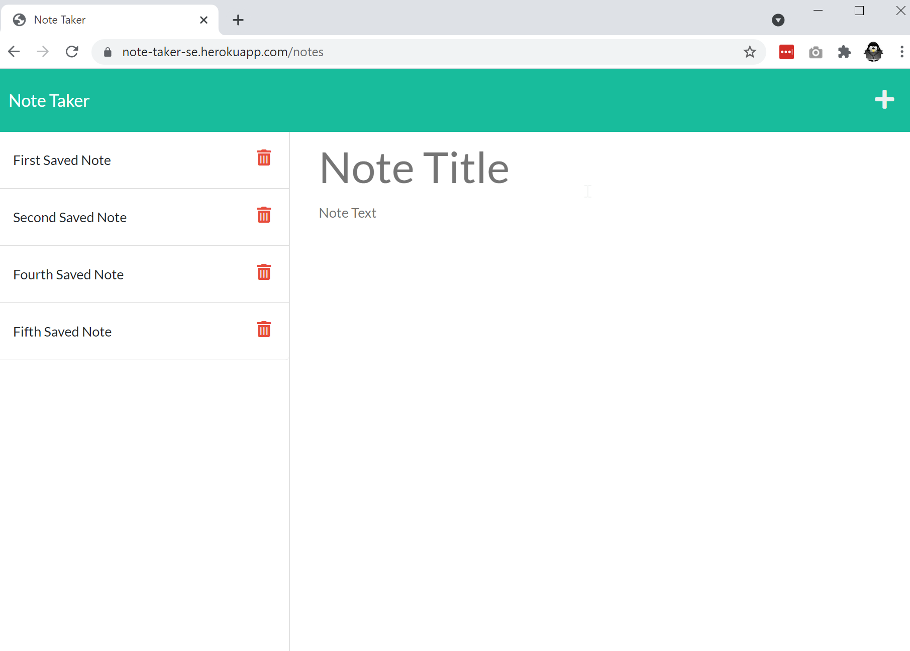

# TITLE: NOTE TAKER

## Project Function:  
Command-line application to generate, write and save notes. 

## Project Title: # note-taker
Purpose: This project was created to explore JavaScript ES6, node, module imports, dynamic file generation and to improve skills working with functions. 

**Creation date:** July 2021  
**Collaborators:** Sheri Elgin

## Screen Cap

## Project Links
GitHub Source Code: https://github.com/grudgecat/note-taker  
Heroku published link: https://note-taker-se.herokuapp.com/ 

***
## Dependencies 
node.js https://nodejs.org/en/  
package dependencies:  
 * express: 4.17.1  
 * path: 0.12.7  
 * uuid: 8.3.2 